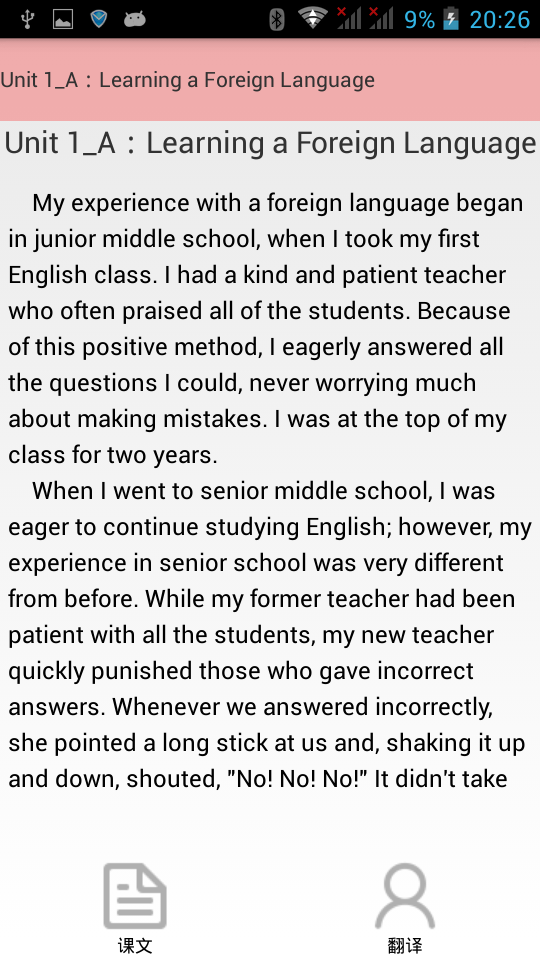
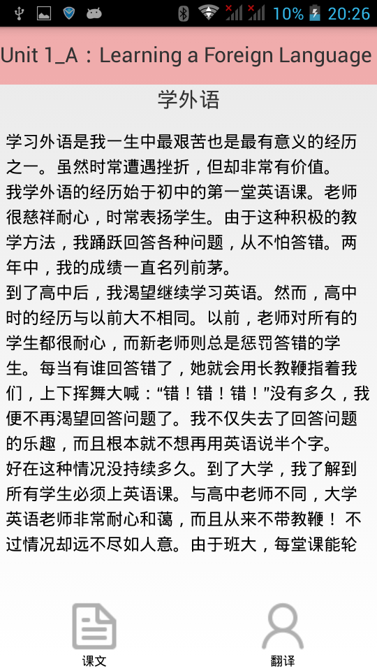
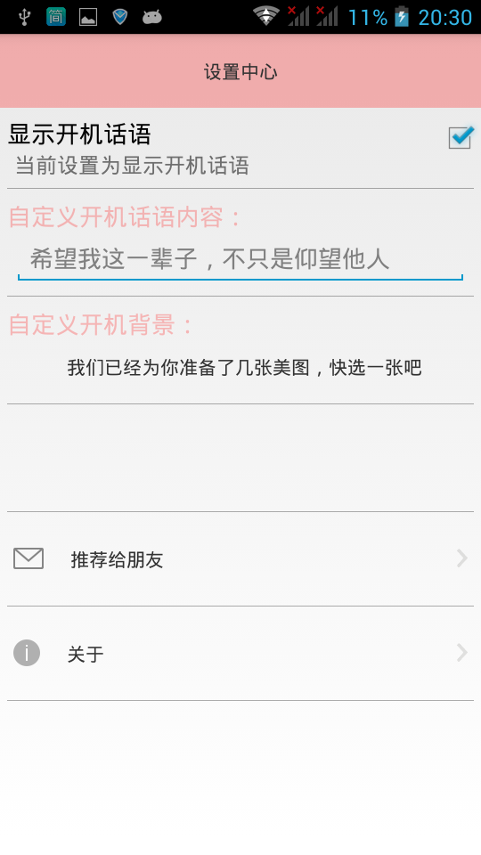

# MasterEnglish

基于安卓平台的英语课文学习软件，方便在阅读英文文章时候查询单词，包括音标、含义、读音等。

## 数据库设计
文章采用本地数据库存储的形式——直接将文章写入到数据库中，然后复制到SD卡中。

## 查询单词
使用了webservice
1. http://fy.webxml.com.cn/webservices/EnglishChinese.asmx/TranslatorString?wordKey=hello
2. "http://fy.webxml.com.cn/sound/" + duYin

## 文档和证书
该作品是本科时候的期末大作业
* 文档见 MasterEnglish软件用户使用手册.doc
* 证书见 MasterEnglish英语课文学习软件_软著.pdf
* 最新版本的安装文件见 ME2.apk